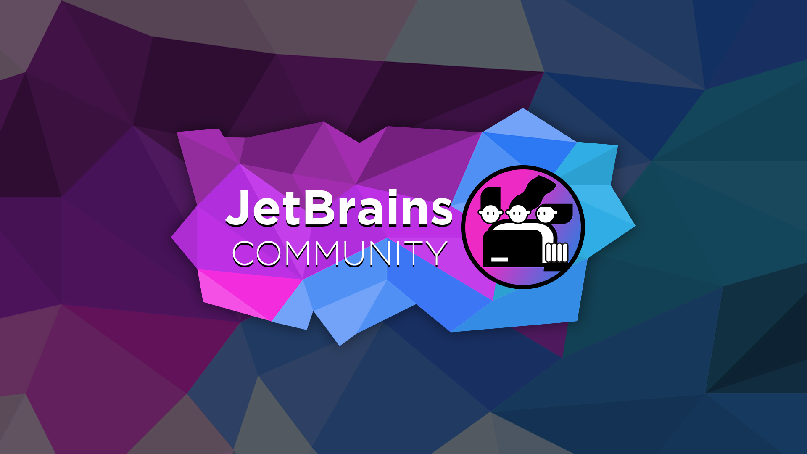

# JetBrains Community - brand

A collection of all our logos and other branding images

The original JetBrains Community icon was created by JetBrains for the JetBrains Community.

All further branding artwork was created by the JetBrains Community team for the JetBrains Community projects.

---

## All brand assets

### Main Image

(The main JetBrains Community brand image)

### Main Avatar

(The JetBrains Community icon / avatar)

### Smaller Avatar

(For use on reddit [mobile icon])

### Reddit Header

(For use on reddit [redesign header])

### Twitter Header

(For use on twitter [header image])

### Preview Image

(For use in meta data [preview image])

### Selector - Discord

(For use on the community selector [discord])

### Selector - Reddit

(For use on the community selector [reddit])

### Original Icon

(The original JetBrains community icon [created for us by JetBrains])

